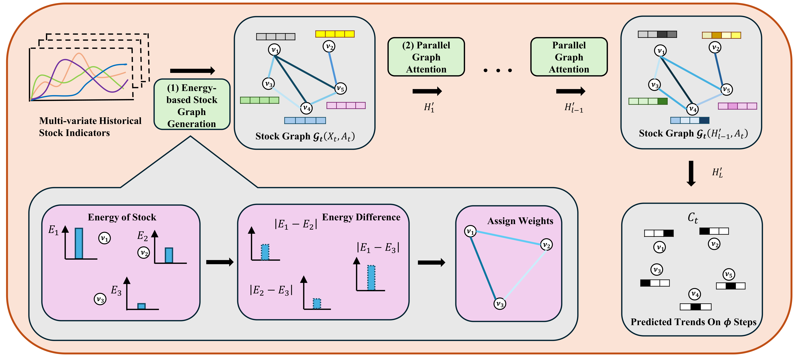

# EP-GAT: Energy-based Parallel Graph Attention Neural Network for Stock Trend Classification

📄 [**Paper**](https://ieeexplore.ieee.org/abstract/document/11228083) accepted by IJCNN 2025

[](LICENSE)



## 1. Configuration

Please refer to the `Setup` section in the [code](EP-GAT.ipynb).

## 2. Dataset

- The raw data used in this paper is provided as `.csv` files under `~/data/`.
- The dataset is collected from five markets: `LSE, FTSE, NASDAQ, NYSE, S&P`.
- For customed dataset, please refer to the [code](EP-GAT.ipynb) for expected CSV format and preprocessing steps.

## 3. Training

Please follow the instructions and the code in the [`ipynb`](EP-GAT.ipynb) file.

## 3. Citation 

If you think this project is helpful, please feel free to leave a star or cite our paper:

```bibtex
@inproceedings{jiang2025ep,
  title={EP-GAT: Energy-based Parallel Graph Attention Neural Network for Stock Trend Classification},
  author={Jiang, Zhuodong and Zhang, Pengju and Martin, Peter},
  booktitle={2025 International Joint Conference on Neural Networks (IJCNN)},
  pages={1--8},
  year={2025},
  organization={IEEE}
}
```
